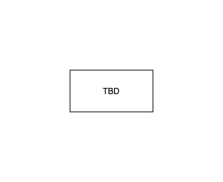

# YOUR DOMAIN README

## Intro

This should be replaced by content that fits your domain.

Before you start editing this repository, please read the [TEMPLATE README](./docs/template-readme/README.md)

## Architecture

