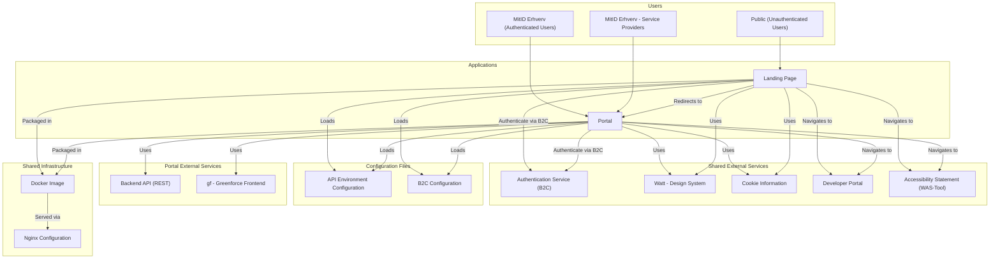

# Level 1 Context Diagram for Energy Track And Trace (frontend)

## Overview

This document provides the Level 1 Context Diagram for Energy Track And Trace, which includes two frontend applications (**Landing Page** and **Portal**) and their interactions with external users and services.

## Key Components

### Users

- **Public (Unauthenticated Users):** General users who can access the landing page and portal but cannot log in.
- **MitID Erhverv (Authenticated Users):** End users who can log in to the portal and interact with its features.
- **MitID Erhverv - Service Provider (Authenticated Users):** End users who can log in to the portal and interact with its features.

### Applications

- **Landing Page (app-eo-landing-page):** Serves as the initial entry point for users and loads the **API Environment Config** and **B2C Config during runtime**.

- **Portal (app-eo):** The main application for managing energy-related activities and also dynamically loads **API Environment Config** and **B2C Config** during runtime.

### Configuration Files

- **API Environment Configuration:** Contains environment-specific settings such as API endpoints. Loaded dynamically by both the **Landing Page and Portal** via HTTP at runtime.

- **B2C Configuration:** Includes authentication-related settings such as tenant IDs, policies, and authority URLs. Loaded dynamically by both the **Landing Page** and **Portal** to ensure compatibility with the B2C Authentication Service.

### External Services

- **Authentication Service (B2C):** Provides authentication for users logging into the portal and ensures terms of use are accepted for first-time logins.
- **Developer Portal** Portal for the backend API.
- **Backend API:** REST-based API handling business logic and data operations (e.g., certificates, contracts, consents).
- **Cookie information** Assists in collecting and managing user consent for cookies.
- **WAS-Tool** Digital solution for accessibility statements.

### Shared Resources

- **Design System:** A shared library that provides reusable UI components, styles, and branding assets. This system ensures consistency and improves developer productivity across both the Landing Page and the Portal.
- **Greenforce frontend (gf):** A shared library of utilities within the monorepo, designed to support functionality outside the scope of the design system.
- **Shared Docker Image:** Both the Landing Page and Portal are packaged into a single Docker image for consistent runtime environments.
- **Nginx Configuration:** A shared Nginx configuration serves both applications, handling routing and static asset delivery.

## Key Interactions

### Between Applications and Services

- **Landing Page** interacts with **Portal** to direct users to the portal.
- Both **Landing Page** and **Portal** navigate to shared destinations like the **Developer Portal** and **WAS-Tool** through a shared navigation component.
- **Portal** uses **Authentication Service** for user authentication and ensures users accept terms of use upon their first login.
- **Portal** interacts with the **Backend API** to perform all business operations. Instead of elaborating on each API call, these operations can be grouped into specific categories or domains:
  * **Dashboard:** Aggregated production and consumption.
  * **Certificates Domain:** Manage and retrieve energy certificates.
  * **Claims Domain:** Handle claims and claim automation processes.
  * **Transfers Domain:** Manage energy transfer agreements and their activities.
  * **Contracts Domain:** Create, update, and end contracts.
  * **Consents Domain:** Manage user consents (accept, revoke).
  * **Activity Logs:** Retrieve logs related to transfers, metering points, and other actions.
