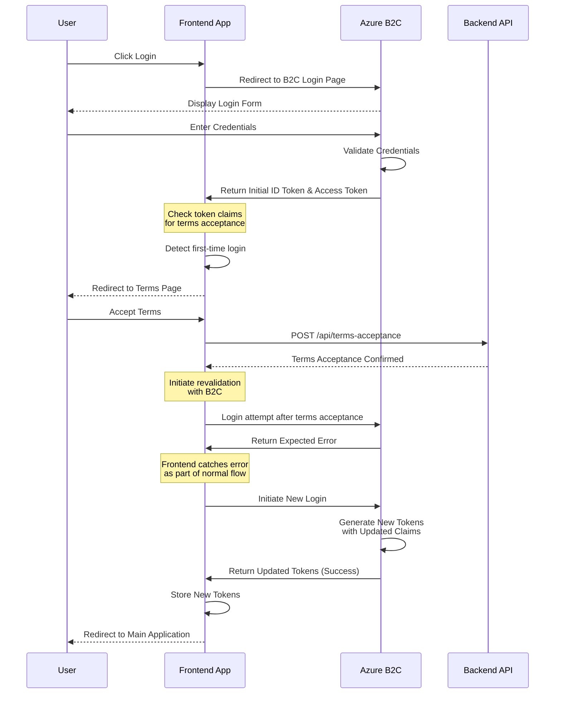
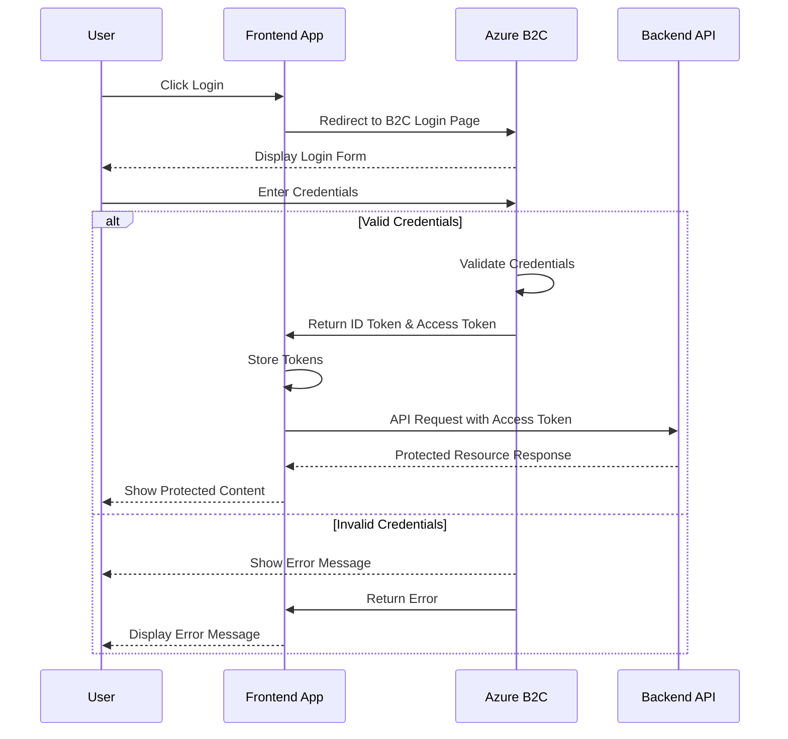
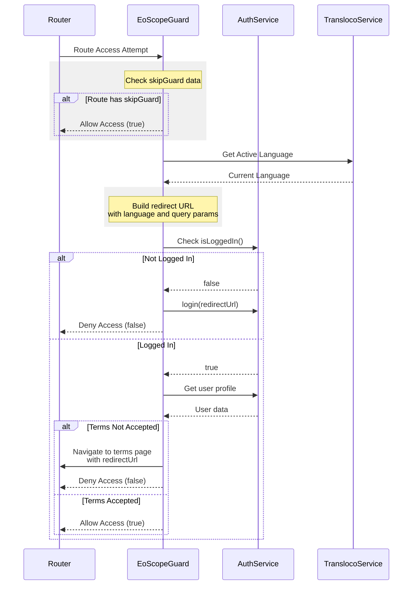
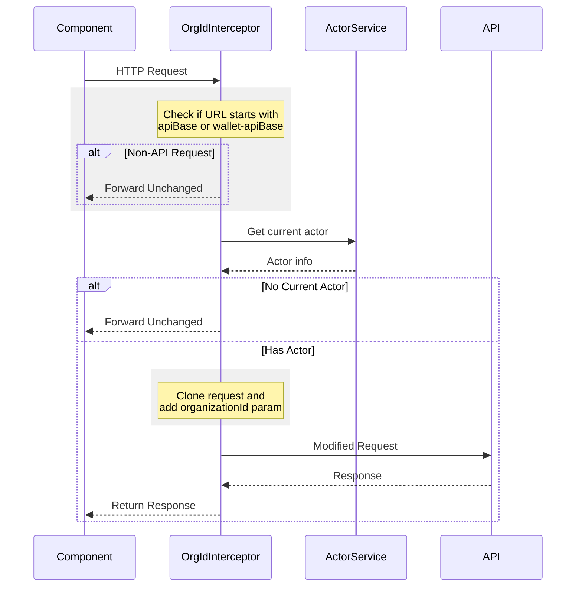
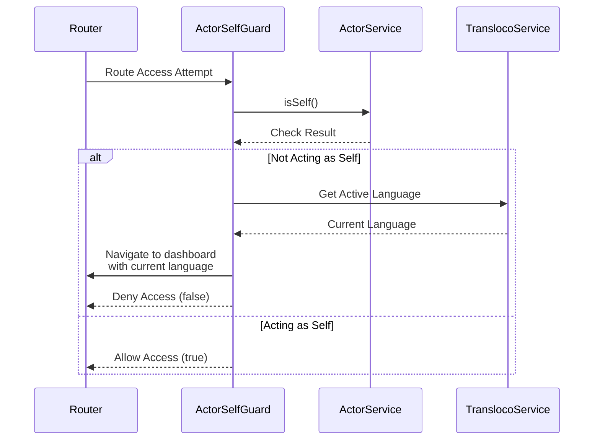
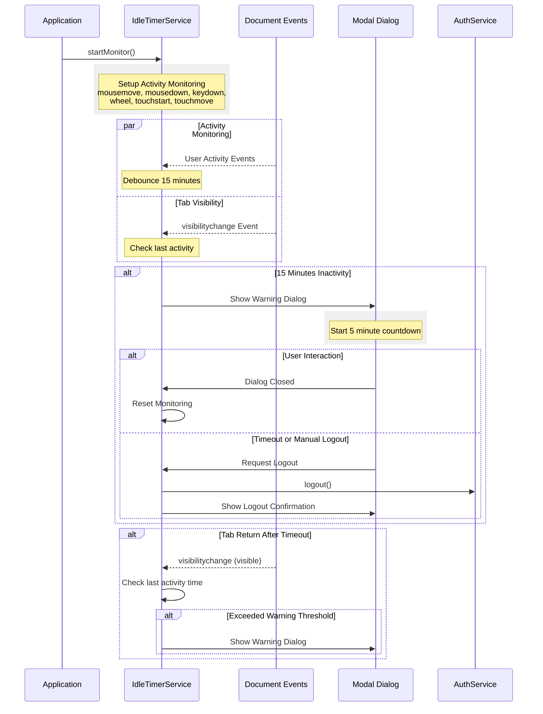

# Authentication in Energy Track And Trace

## Overview

Energy Track And Trace implements authentication using Azure Active Directory B2C with the **oidc-client-ts** library. This approach was chosen over MSAL (used in DataHub) for its:

- Simpler integration pattern
- Cleaner codebase
- Better maintainability with Angular version updates
- Reduced dependency on external maintenance

> **Development Note**: Local and demo environments use an **oidc-mock** implementation. This means certain authentication flows (like user terms acceptance) can only be fully tested against production, as claims like **TOS_ACCEPTED** are hardcoded in the mock.

## Authentication Flows

### 1. First-time User Login

When a user logs in for the first time, they must accept terms of service before gaining full access:



### 2. Standard Login

Subsequent logins follow a simpler flow after terms have been accepted:



## Core Components

### 1. Authorization Interceptor

Manages HTTP request authentication and token handling:

#### Features

- Automatic Bearer token injection
- Smart token refresh on mutations (PUT/POST/DELETE)
- API endpoint filtering
- Comprehensive error handling

````mermaid
sequenceDiagram
    participant C as Component
    participant I as EoAuthInterceptor
    participant AS as AuthService
    participant API as API
    participant T as ToastService

    C->>I: HTTP Request

    rect rgb(240, 240, 240)
        Note over I: Check if URL starts with<br/>apiBase or wallet-apiBase
        alt Non-API Request
            I-->>C: Forward Unchanged
        end
    end

    rect rgb(240, 240, 240)
        Note over I: Add Authorization Header
        I->>AS: Get access_token
        AS-->>I: Return token
        I->>I: Clone request with<br/>Authorization header
    end

    I->>API: Send Authorized Request

    alt Successful Response
        API-->>I: Response 200

        rect rgb(240, 240, 240)
            Note over I: Check token refresh condition
            alt Should Refresh Token (PUT/POST/DELETE && not ignored URL)
                I->>AS: renewToken()
            end
        end

        I-->>C: Return Response
    else Error Response
        alt 403 Forbidden
            API-->>I: Response 403
            I->>T: Display Permission Error
            I-->>C: Return Error
        else 401 Unauthorized
            API-->>I: Response 401
            I->>AS: logout()
            I-->>C: Return Error
        else Other Error
            API-->>I: Error Response
            I-->>C: Return Error
        end
    end
````

### 2. Scope Guard

Protects routes and manages authentication state:

#### Key Functions

- Route protection
- Authentication validation
- Terms acceptance verification
- Language-aware redirects



### 3. Organization ID Interceptor

Manages organizational context for API calls:

#### Responsibilities

- Organization ID injection
- Request filtering
- Context preservation



### 4. Actor Self Guard

Controls access based on user context:

#### Features

- Self-context verification
- Smart redirects
- Language preservation



### 5. Idle Timer Service

Manages session timeouts and user activity:

#### Behavior

- 15-minute inactivity warning
- 5-minute grace period
- Multi-tab support
- Activity monitoring



## Security Features

### Token Management

- Automatic token refresh for mutations
- Secure token storage
- Token validation
- Clear token lifecycle

### Error Handling

1. **Authentication Errors**
   - 401: Automatic logout
   - 403: Permission notifications
   - Generic errors: Proper propagation

2. **Session Management**
   - Inactivity detection
   - Grace period warnings
   - Secure logout process

### Context Security

- Organization isolation
- Self-context protection
- Route guards
- API request filtering

## Best Practices

### Development Guidelines

1. Always use appropriate guards for protected routes
2. Implement proper error handling
3. Consider organizational context
4. Test thoroughly against production B2C

### Common Pitfalls

- Testing limitations with oidc-mock
- Token refresh timing
- Multi-tab synchronization
- Organization context switching

## Integration Points

### External Systems

- Azure AD B2C
- Backend API
- Wallet API

### Internal Services

- Translation Service
- Toast Notifications
- Modal Service
- Router Service
