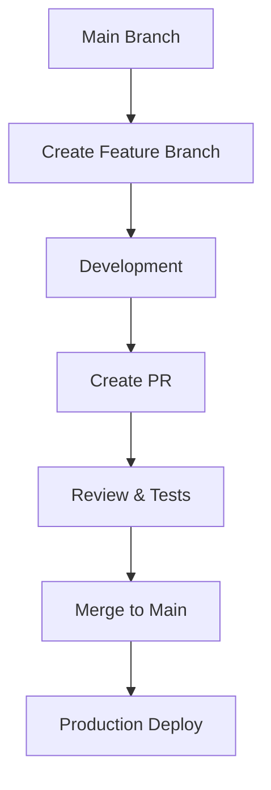

# Energy Track And Trace Developer Guide

## Overview

This guide walks you through the process of making and deploying changes to Energy Track And Trace. Follow these steps carefully to ensure smooth integration of your changes.

## Prerequisites

- [ ] GitHub access to the repository
- [ ] Basic Git knowledge
- [ ] Teams channel access
- [ ] Azure B2C access (for frontend changes)

## Development Workflow

### 1. Branch Creation

> ⚠️ **Critical: Branch naming affects CI/CD pipelines**

#### Naming Convention

- Follow the [branching strategy](branching-strategy.md) exactly
- Branch name determines:
  - Which pipelines run
  - Environment configuration
  - Deployment targets

### 2. Development Process

1. **Initial Setup**

   - Create your branch
   - Make code changes
   - Follow coding standards

2. **Pull Request Creation**

   - Use draft PR for work in progress
   - Regular PR when ready for review
   - Include clear description of changes

3. **Test Environment Setup**

   - Automatic deployment triggers after PR creation
   - Access your environment:
     1. Visit [eo-base-environments actions](https://github.com/Energinet-DataHub/eo-base-environment/actions)
     2. Search: `branch:<your-branch-name>`
     3. Find: `Automated vCluster Creation` or `Infrastructure CD preview environment`
     4. Locate environment URL in `deploy summary`

4. **B2C Configuration**
   - Add environment URL to B2C redirect URLs
   - Verify authentication flow

### 3. Review Process

#### Code Review

1. Share PR in Teams `review` channel
2. Request specific reviews:
   - UI review for frontend changes
   - Architecture review for major changes
3. Address feedback promptly

#### Testing Checklist

- [ ] Unit tests pass
- [ ] Integration tests pass
- [ ] UI tests (if applicable)
- [ ] Manual testing in preview environment

### 4. Merging and Deployment

> ⚠️ **Warning: Main branch changes auto-deploy to production**

#### Pre-merge Checklist

- [ ] All pipeline checks green
- [ ] Code review approved
- [ ] UI changes verified
- [ ] Documentation updated

#### Post-merge Steps

1. Monitor production deployment
2. Perform smoke tests
3. Verify functionality
4. Watch monitoring dashboards

### 5. Cleanup

#### Repository Cleanup

1. Delete your branch from:
   - Main repository
   - eo-base-environment repository
     - URL: `github.com/Energinet-DataHub/eo-base-environment/branches`

## Troubleshooting Guide

### Common Issues

1. **Pipeline Failures**

   - Check pipeline logs
   - Verify branch naming
   - Review environment variables

2. **Environment Issues**

   - Confirm B2C configuration
   - Check service connections
   - Verify environment URLs

3. **Authentication Problems**
   - Review B2C settings
   - Check redirect URLs
   - Verify token configuration

### Getting Help

1. **Documentation**

   - [CI Guide](continues-integration.md)
   - [CD Guide](continues-deployment.md)
   - [Branching Strategy](branching-strategy.md)

2. **Support Channels**
   - Teams review channel
   - Development chat
   - Issue tracker

## Best Practices

1. **Branch Management**

   - Keep branches short-lived
   - Regular rebasing with main
   - Clean commit history

2. **Testing**

   - Test in preview environment
   - Cross-browser testing
   - Mobile responsiveness

3. **Code Quality**

   - Follow style guides
   - Write clear comments
   - Update documentation

4. **Deployment**
   - Monitor deployments
   - Verify in production
   - Keep cleanup checklist

## Additional Resources

- [Architecture Documentation](architecture.md)
- [API Documentation](api-docs.md)
- [Environment Setup](environment-setup.md)
