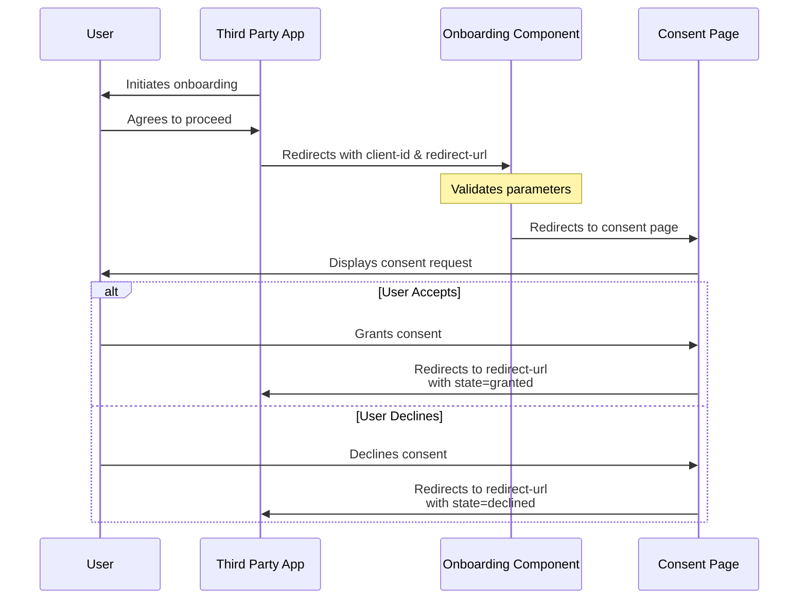

# Third-Party Onboarding Flow

## Overview

This documentation describes the integration flow for third-party applications requesting power of attorney from their users through our system.



## Demo Environments

Access the onboarding demo page in different environments:

- **Development**: `http://localhost:4200/assets/html/onboarding-demo.html?client-id=9d7831a2-0ba7-47ed-baa9-4348f4526e09`
- **Demo**: `https://demo.energytrackandtrace.dk/assets/html/onboarding-demo.html?client-id=9d7831a2-0ba7-47ed-baa9-4348f4526e09`
- **Production**: `https://energytrackandtrace.dk/assets/html/onboarding-demo.html`

## Implementation Location

The static demonstration page is located at:

```bash
libs/eo/shared/assets/src/assets/html/onboarding-demo.html
```

## Integration Steps

### 1. Initial Redirect

Third-party applications should redirect users to our onboarding endpoint with the following required parameters:

```bash
<domain>/onboarding?client-id=${clientId}&redirect-url=${redirectUrl}
```

Parameters:

- `client-id`: Unique identifier for the third-party application
- `redirect-url`: URL where the user should be redirected after the consent process

### 2. Consent Flow

The onboarding component processes the parameters and redirects the user to our consent page, where they can:

- Review the requested permissions
- Accept or decline the power of attorney request

### 3. Response Handling

After user action, if a redirect URL was specified:

- The system redirects to the provided URL
- Appends a `state` parameter with one of two values:
  - `granted`: User accepted the consent
  - `declined`: User declined the consent

## Error Handling

Third-party applications should:

- Validate the returned state parameter
- Implement appropriate error handling for declined consents
- Handle cases where users abandon the flow before completion
